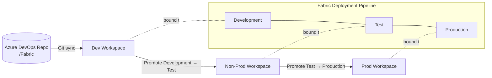
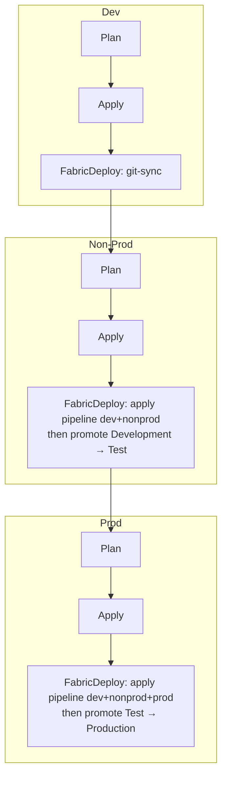
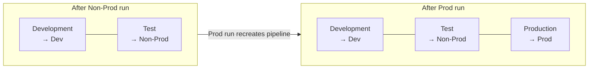

# FabricOps — Terraform-Managed Microsoft Fabric Workspaces

Infrastructure-as-Code for provisioning **Microsoft Fabric** workspaces across three
environments (Dev, Non-Prod, Prod) and promoting content between them through a
**Fabric deployment pipeline** — all orchestrated by a single Azure DevOps pipeline.

- **Terraform** (with the [`microsoft/fabric`](https://registry.terraform.io/providers/microsoft/fabric/latest/docs) provider) defines the desired state: the workspaces, their Git connection, and the deployment pipeline.
- **Azure DevOps** runs `plan` → `apply` → `fabric-deploy` for each environment, strictly in order.
- **PowerShell** scripts perform the imperative Fabric REST actions (Git sync and stage promotion) that Terraform cannot model declaratively.

---

## Table of Contents

- [What it deploys](#what-it-deploys)
- [How it deploys](#how-it-deploys)
- [Repository layout](#repository-layout)
- [Prerequisites](#prerequisites)
- [One-time setup](#one-time-setup)
- [Running locally](#running-locally)
- [Configuration reference](#configuration-reference)
- [The deployment flow in detail](#the-deployment-flow-in-detail)
- [Building the deployment pipeline incrementally](#building-the-deployment-pipeline-incrementally)
- [Adding Fabric content](#adding-fabric-content)
- [Troubleshooting](#troubleshooting)
- [Learn more](#learn-more)

---

## What it deploys

| Resource | Terraform | Notes |
|----------|-----------|-------|
| **Dev workspace** | `fabric_workspace` + `fabric_workspace_git` | Connected to this Azure DevOps repo. Content is sourced from Git. |
| **Non-Prod workspace** | `fabric_workspace` | Receives content via the deployment pipeline. |
| **Prod workspace** | `fabric_workspace` | Receives content via the deployment pipeline. |
| **Deployment pipeline** | `fabric_deployment_pipeline` | Stages `Development → Test → Production`, each bound to the matching workspace. |

Each environment is an **independent Terraform root** with its own remote state, so they can
be planned and applied in isolation. The deployment pipeline is a **fourth root** that reads
the workspace IDs from the environment states via `terraform_remote_state` and wires the
stages to the right workspaces.



---

## How it deploys

The Azure DevOps pipeline ([azure-pipelines.yml](azure-pipelines.yml)) processes the three
environments **sequentially** — Non-Prod only starts after Dev's Fabric deploy succeeds, and
Prod only after Non-Prod's. Each environment expands into three stages from the reusable
template [.azuredevops/templates/fabric-env-stages.yml](.azuredevops/templates/fabric-env-stages.yml):

1. **Plan** — `terraform init` + `terraform plan`, publishing the plan as an artifact.
2. **Apply** — `terraform apply` of the published plan (gated by an ADO *environment* for approvals), publishing the resulting `workspace_id`.
3. **FabricDeploy** — the content deploy, which differs by environment:

| Environment | `fabricDeployMode` | What happens |
|-------------|--------------------|--------------|
| **dev** | `git-sync` | Calls Fabric *Update From Git* to pull the latest committed `/Fabric` content into the Dev workspace. |
| **nonprod** | `pipeline-deploy` | Applies the deployment-pipeline root with `active_environments = ["dev","nonprod"]`, then promotes **Development → Test**. |
| **prod** | `pipeline-deploy` | Applies the deployment-pipeline root with `active_environments = ["dev","nonprod","prod"]`, then promotes **Test → Production**. |

> **Why the pipeline grows incrementally — and never shrinks:** `fabric_deployment_pipeline.stages`
> is *ForceNew* — changing the stage list recreates the pipeline. The pipeline is wired with only
> the stages for environments that are live, expanding from two stages (when Non-Prod deploys) to
> three (when Prod deploys). Crucially, the deployment-pipeline root **detects the stages already
> present on the live pipeline and preserves them**, so re-running an earlier environment can never
> tear a later stage back off — the pipeline is *grow-only*. See
> [Building the deployment pipeline incrementally](#building-the-deployment-pipeline-incrementally).

Authentication uses **Workload Identity Federation (OIDC)** — no secrets stored. The
`AzureCLI@2` task exposes the federated token, which is surfaced to Terraform's `azurerm`
backend and the Fabric provider as environment variables, and to the PowerShell scripts as a
Fabric access token.

Shared **non-secret** configuration (the service connection name, the state backend names, and
the Dev Git-integration identifiers) comes from the `fabricops-config`
[variable group](#4-create-the-pipeline-variable-group-fabricops-config) — no secrets are
stored there either. `tenant_id` and `client_id` are injected automatically from the service
connection at runtime.

---

## Repository layout

```
FabricOpsTerraformDeploy/
├── azure-pipelines.yml              # Root ADO pipeline (dev → nonprod → prod)
├── .azuredevops/
│   └── templates/
│       └── fabric-env-stages.yml    # Reusable Plan/Apply/FabricDeploy template
├── Fabric/                          # Fabric item definitions tracked in Git (Dev source)
├── scripts/
│   ├── FabricApi.ps1                # Shared Fabric REST helpers (token, request, LRO polling)
│   ├── Invoke-FabricGitSync.ps1     # Dev: Update From Git
│   └── Invoke-FabricDeployStage.ps1 # Non-Prod/Prod: promote between pipeline stages
└── Terraform/
    ├── modules/
    │   ├── workspace/               # Wraps fabric_workspace
    │   └── deployment_pipeline/     # Wraps fabric_deployment_pipeline
    ├── workspaces/
    │   ├── dev/                     # Dev workspace + Git integration root
    │   ├── nonprod/                 # Non-Prod workspace root
    │   └── prod/                    # Prod workspace root
    └── deployment_pipeline/         # Deployment pipeline root (reads workspace IDs via remote state)
```

---

## Prerequisites

| Requirement | Detail |
|-------------|--------|
| **Terraform** | `>= 1.5.0`. In CI, Terraform runs via the `hashicorp/terraform` container image (tag set by the `TF_VERSION` pipeline variable) — no install needed on the agent. For [local runs](#running-locally), [install Terraform](https://developer.hashicorp.com/terraform/install). |
| **Microsoft Fabric** | A tenant with Fabric enabled, and (optionally) a [Fabric capacity](https://learn.microsoft.com/fabric/enterprise/licenses) to assign |
| **Entra ID service principal** | Used for all automation. Needs Fabric workspace admin rights and permission to create/manage deployment pipelines |
| **Azure subscription** | Hosts the Azure Storage account used for Terraform remote state |
| **Azure DevOps** | Project + repo (this one), plus a service connection with Workload Identity Federation |
| **Azure DevOps variable group** | `fabricops-config` holding non-secret pipeline config (service connection, backend names, Dev Git values) — see [setup](#4-create-the-pipeline-variable-group-fabricops-config) |
| **PowerShell 7+** | The deploy scripts target `pwsh` (`pscore`); used automatically by the ADO agent |
| **Azure CLI** | Used by the pipeline to obtain the Fabric token (`az account get-access-token`) |
| **Docker** | Must be available on the build agent — the pipeline runs Terraform through the `hashicorp/terraform` image inside the `AzureCLI@2` tasks (the `TerraformInstaller` marketplace task is not used). |

### Required service principal permissions

- **Fabric tenant settings** must allow service principals to use the Fabric APIs and to create workspaces / deployment pipelines (Admin portal → Tenant settings).
- The SPN must be **Admin** on each workspace it manages.
- For Git integration, the SPN authenticates through a **pre-created Fabric connection** (`ConfiguredConnection`) — service-principal Git auth is only supported via a configured connection, not inline credentials.

---

## One-time setup

### 1. Create the Terraform state backend (Azure Storage)

```powershell
az group create --name rg-fabricops-tfstate --location eastus
az storage account create `
  --name stfabricopstfstate `
  --resource-group rg-fabricops-tfstate `
  --sku Standard_LRS `
  --kind StorageV2
az storage container create `
  --name tfstate `
  --account-name stfabricopstfstate `
  --auth-mode login
```

> Names must match the `backend*` variables in [azure-pipelines.yml](azure-pipelines.yml)
> (`rg-fabricops-tfstate`, `stfabricopstfstate`, `tfstate`) or be overridden there.

State keys per root: `fabric/dev.tfstate`, `fabric/nonprod.tfstate`, `fabric/prod.tfstate`,
`fabric/deployment-pipeline.tfstate`.

> **Key-less (Entra ID) state access.** The Terraform backend authenticates to this storage
> account with Entra ID (`use_azuread_auth = true`), not account keys — `listKeys` is denied by
> policy. Grant the pipeline's service principal the **Storage Blob Data Contributor** role on the
> state storage account (do this after creating the service connection in step 3):
>
> ```powershell
> az role assignment create `
>   --assignee <pipeline-spn-object-id> `
>   --role "Storage Blob Data Contributor" `
>   --scope $(az storage account show --name stfabricopstfstate --resource-group rg-fabricops-tfstate --query id -o tsv)
> ```

### 2. Create the Fabric Git connection

Create a [Fabric connection](https://learn.microsoft.com/fabric/data-factory/azure-devops-connection)
to your Azure DevOps repository and note its **connection ID** — this becomes `git_connection_id`
in the Dev tfvars. This is required because the SPN connects to Git through a configured connection.

### 3. Configure the Azure DevOps service connection (OIDC)

Create an **Azure Resource Manager** service connection named `fabric-azure-connection`
(or override `serviceConnection`) using **Workload Identity Federation**. This lets the
pipeline authenticate to both Azure (for state) and Fabric without storing secrets.
See [Workload identity federation](https://learn.microsoft.com/azure/devops/pipelines/library/connect-to-azure?view=azure-devops#create-an-azure-resource-manager-service-connection-using-workload-identity-federation).

### 4. Create the pipeline variable group (`fabricops-config`)

The pipeline reads its shared, **non-secret** configuration from an Azure DevOps **variable
group** named `fabricops-config` (Pipelines → Library). Authentication still uses OIDC, so this
group holds **no secrets** — only identifiers and names.

| Variable | Example | Used by |
|----------|---------|---------|
| `serviceConnection` | `fabric-azure-connection` | All stages (Azure/Fabric auth) |
| `backendResourceGroup` | `rg-fabricops-tfstate` | `terraform init` backend |
| `backendStorageAccount` | `stfabricopstfstate` | `terraform init` backend |
| `backendContainerName` | `tfstate` | `terraform init` backend |
| `git_connection_id` | `11111111-1111-1111-1111-111111111111` | Dev workspace Git integration |
| `git_organization_name` | `MyOrg` | Dev workspace Git integration |
| `git_project_name` | `MyProject` | Dev workspace Git integration |
| `git_repository_name` | `FabricOpsTerraformDeploy` | Dev workspace Git integration |
| `git_branch_name` | `main` | Dev workspace Git integration |

Create and populate it with the Azure CLI (`az devops` extension):

```powershell
az devops configure --defaults organization=https://dev.azure.com/MyOrg project=MyProject

az pipelines variable-group create `
  --name fabricops-config `
  --authorize true `
  --variables `
    serviceConnection=fabric-azure-connection `
    backendResourceGroup=rg-fabricops-tfstate `
    backendStorageAccount=stfabricopstfstate `
    backendContainerName=tfstate `
    git_connection_id=11111111-1111-1111-1111-111111111111 `
    git_organization_name=MyOrg `
    git_project_name=MyProject `
    git_repository_name=FabricOpsTerraformDeploy `
    git_branch_name=main
```

> `--authorize true` lets the pipeline consume the group without a manual authorization prompt.
> Keep every value **non-secret** — if you mark one secret, the Terraform `-var` substitution
> (e.g. `$(git_connection_id)`) won't expand inside the inline scripts.

Update a value later with:

```powershell
az pipelines variable-group variable update `
  --group-id <id> --name git_branch_name --value main
```

### 5. Create ADO environments for approvals (optional but recommended)

The Apply and FabricDeploy stages target ADO *environments* named `fabric-dev`,
`fabric-nonprod`, and `fabric-prod`. Create these under **Pipelines → Environments** and add
approval checks where you want manual gates (typically Non-Prod and Prod).

### 6. Provide environment configuration (local runs only)

In Azure DevOps the pipeline supplies its variables from the service connection
(`tenant_id`/`client_id`) and the `fabricops-config` variable group (Dev Git values + backend
names), so **no `.tfvars` are needed in CI**. The `.tfvars`/`.hcl` files are **gitignored** and
used only when [running locally](#running-locally).

For local runs, copy each `*.example` to a real (gitignored) file and fill in your values:

```powershell
Copy-Item Terraform/workspaces/dev/terraform.tfvars.example Terraform/workspaces/dev/terraform.tfvars
Copy-Item Terraform/workspaces/dev/backend.hcl.example      Terraform/workspaces/dev/dev.backend.hcl
# repeat for nonprod, prod, and deployment_pipeline
```

At minimum, set the Dev Git integration values (`git_connection_id`, `git_organization_name`,
`git_project_name`, `git_repository_name`, `git_branch_name`).

---

## Running locally

You can apply any root by hand (useful for first-time bootstrap or debugging). From the root:

```powershell
cd Terraform/workspaces/dev

# Initialize with the backend config
terraform init -backend-config="dev.backend.hcl"

# Plan / apply (auth via tfvars or env vars)
terraform plan  -var-file="terraform.tfvars"
terraform apply -var-file="terraform.tfvars"
```

To run the Fabric REST actions locally, set a token and the required variables, then invoke the script:

```powershell
$env:FABRIC_TOKEN = az account get-access-token --resource https://api.fabric.microsoft.com --query accessToken -o tsv
$env:FABRIC_WORKSPACE_ID = terraform output -raw workspace_id
./scripts/Invoke-FabricGitSync.ps1
```

> **Order matters.** The deployment pipeline root reads the workspace IDs from each
> environment's state, so apply Dev/Non-Prod/Prod **before** applying
> `Terraform/deployment_pipeline`.

---

## Configuration reference

### Workspace roots (`Terraform/workspaces/*`)

| Variable | Default | Description |
|----------|---------|-------------|
| `tenant_id` | `null` | Entra tenant ID (or `FABRIC_TENANT_ID`). |
| `client_id` | `null` | SPN client ID (or `FABRIC_CLIENT_ID`). |
| `use_oidc` | `false` | Use Workload Identity Federation. Set `true` in CI. |
| `workspace_display_name` | `FabricOps-<Env>` | Workspace name. |
| `workspace_description` | — | Workspace description. |
| `capacity_id` | `null` | Fabric capacity to assign (null = shared). |
| `identity_type` | `null` | `SystemAssigned` or null. |
| `skip_capacity_state_validation` | `false` | Skip capacity-state checks when the caller can't list capacities. |

**Dev only — Git integration:**

| Variable | Default | Description |
|----------|---------|-------------|
| `enable_git_integration` | `true` | Connect Dev to Azure DevOps. |
| `git_connection_id` | `null` | Pre-created Fabric connection ID (required for SPN auth). |
| `git_organization_name` / `git_project_name` / `git_repository_name` / `git_branch_name` | `null` | ADO coordinates. |
| `git_directory_name` | `/Fabric` | Folder in the repo holding Fabric items (must start with `/`). |
| `git_initialization_strategy` | `PreferRemote` | `PreferRemote` seeds the workspace from Git; `PreferWorkspace` seeds Git from the workspace. |

### Deployment pipeline root (`Terraform/deployment_pipeline`)

| Variable | Default | Description |
|----------|---------|-------------|
| `backend_resource_group_name` / `backend_storage_account_name` | — | Where the environment state files live (for remote-state ingestion). |
| `backend_container_name` | `tfstate` | State container. |
| `state_keys` | `{dev, nonprod, prod → fabric/*.tfstate}` | Map of env → state blob key. |
| `deployment_pipeline_display_name` | `FabricOps-Pipeline` | Pipeline name. |
| `stages` | Development/Test/Production → dev/nonprod/prod | Ordered stages (2–10). Each stage's workspace is resolved from `source_environment`'s remote state. |
| `active_environments` | `["dev","nonprod","prod"]` | Which environments' stages are currently wired. Pipeline grows as environments come online. |

---

## The deployment flow in detail



1. **Dev** — Terraform creates/updates the Dev workspace and its Git connection. `Invoke-FabricGitSync.ps1` checks Git status and, if the remote commit differs, calls *Update From Git* and waits for the long-running operation.
2. **Non-Prod** — Terraform creates/updates the Non-Prod workspace. The deployment-pipeline root is applied with two stages (Development, Test) bound to the Dev and Non-Prod workspaces. `Invoke-FabricDeployStage.ps1` then promotes **Development → Test**.
3. **Prod** — Terraform creates/updates the Prod workspace. The deployment-pipeline root is re-applied with all three stages (recreating the pipeline). `Invoke-FabricDeployStage.ps1` promotes **Test → Production**.

The PowerShell helpers ([scripts/FabricApi.ps1](scripts/FabricApi.ps1)) wrap the
[Fabric REST API](https://learn.microsoft.com/rest/api/fabric/articles/), handling the bearer
token and the [long-running-operation](https://learn.microsoft.com/rest/api/fabric/articles/long-running-operation)
poll pattern (202 + `Location` header).

---

## Building the deployment pipeline incrementally

The deployment pipeline is **not** created up front with all three stages. Instead it is grown
as each environment comes online, driven by the `active_environments` variable that the
FabricDeploy stage passes to the `Terraform/deployment_pipeline` root. This matters because
`fabric_deployment_pipeline.stages` is **ForceNew** — any change to the stage list recreates
the whole pipeline object — and because a stage can only be wired to a workspace that already
exists in remote state.

### How `active_environments` shapes the pipeline

The deployment-pipeline root:

1. reads the **remote state** of the environments listed in `active_environments` to get their
   current workspace IDs
   (see [Terraform/deployment_pipeline/remote_state.tf](Terraform/deployment_pipeline/remote_state.tf)),
2. **looks up the live deployment pipeline** (if one already exists) and reads the stages it
   currently has — using the `fabric_deployment_pipelines` list data source (which returns empty,
   rather than erroring, before the pipeline exists) plus the singular `fabric_deployment_pipeline`
   data source, and
3. wires the pipeline to the **union** of the requested `active_environments` and every stage
   already present on the live pipeline — it is **grow-only** and never removes a stage
   (see the `effective_environments` local in [Terraform/deployment_pipeline/main.tf](Terraform/deployment_pipeline/main.tf)).

An active environment's stage is (re)bound from fresh remote state; a stage that is present only
because it is already live keeps its existing workspace assignment (so its remote state does not
even need to be read on that run).

So the requested `active_environments` sets the *minimum* shape of the pipeline, while the live
pipeline's current stages set the *floor* it can never drop below:

| `active_environments` (this run) | Stages already live | Resulting stages |
|----------------------------------|---------------------|------------------|
| `["dev","nonprod"]` | _none (first Non-Prod run)_ | Development, Test |
| `["dev","nonprod","prod"]` | Development, Test | Development, Test, Production |
| `["dev","nonprod"]` | Development, Test, Production | Development, Test, Production _(Prod preserved)_ |

> A deployment pipeline must have **at least two stages**, which is why the pipeline first
> appears during the **Non-Prod** run (Dev alone would be a single stage). Dev's content deploy
> is a Git sync, so it needs no pipeline.

### Why grow-only detection is critical

Each environment passes a **fixed** `active_environments` to the deployment-pipeline root
([azure-pipelines.yml](azure-pipelines.yml)): Non-Prod always passes `["dev","nonprod"]` and Prod
always passes `["dev","nonprod","prod"]`. Those values do **not** change on later runs.

Without grow-only detection, a re-run is destructive. After a full first deployment the live
pipeline has all three stages, but the **Non-Prod** stage runs first and passes only
`["dev","nonprod"]`. Terraform would then compute a two-stage pipeline, see the Production stage
as "removed", and — because `stages` is ForceNew — **delete and recreate the pipeline without
Production**. The pipeline would be left in a broken, Prod-less state until the Prod stage ran
again and rebuilt it. (This is the exact failure this design prevents.)

By reading the live pipeline and taking the **union** with the requested environments, the
Non-Prod re-run keeps all three stages, the plan is a no-op, and Production is never dropped.

### Initial run (greenfield) — stage by stage

On the very first pipeline run, nothing exists yet. Here is what happens to the deployment
pipeline at each environment:

| Order | Environment | `active_environments` | Deployment-pipeline action | Resulting pipeline |
|-------|-------------|------------------------|----------------------------|--------------------|
| 1 | **dev** | _n/a_ | None — Dev uses `git-sync`, not the pipeline. | _does not exist yet_ |
| 2 | **nonprod** | `["dev","nonprod"]` | `terraform apply` **creates** the pipeline with 2 stages (Development → Dev, Test → Non-Prod), then promote **Development → Test**. | 2 stages |
| 3 | **prod** | `["dev","nonprod","prod"]` | `terraform apply` sees a new stage in a ForceNew list and **recreates** the pipeline with 3 stages, then promote **Test → Production**. | 3 stages |



The one-time recreation between the Non-Prod and Prod stages is expected. It replaces the
pipeline **definition** only; the content already promoted into the Non-Prod and Prod
workspaces is untouched. What resets is the pipeline object's own deployment history.

### Second and subsequent runs (steady state)

Once Prod has been deployed at least once, the live pipeline has all three stages. On later runs
each environment **still passes its own fixed `active_environments`** — Non-Prod passes
`["dev","nonprod"]`, Prod passes `["dev","nonprod","prod"]` — but the grow-only detection folds in
the stages already present, so the effective stage list stays at all three. Terraform's plan for
the deployment-pipeline root is therefore a **no-op**:

- **No recreation (and no shrink) happens** — the pipeline is stable across runs.
- Each environment's FabricDeploy stage still runs, but the `terraform apply` of the pipeline
  root simply confirms the existing state, and the only meaningful action is the **promotion**:

| Order | Environment | `active_environments` passed | Effective stages (grow-only) | Pipeline `apply` | Promotion |
|-------|-------------|------------------------------|------------------------------|------------------|-----------|
| 1 | **dev** | _n/a_ | _n/a_ | _n/a_ | Git sync pulls the latest commit into Dev. |
| 2 | **nonprod** | `["dev","nonprod"]` | dev, nonprod, **prod** | no-op | **Development → Test** |
| 3 | **prod** | `["dev","nonprod","prod"]` | dev, nonprod, prod | no-op | **Test → Production** |

In other words: the **first** run *builds* the pipeline (and recreates it once when Prod is
added), while **every run thereafter** just *uses* it to promote content forward — Dev via Git
sync, then Test and Production via stage promotions. The grow-only detection is what keeps the
Non-Prod re-run (step 2) from dropping the Production stage it does not list.

> **Changing stages later** (renaming a stage, reordering, adding a fourth) will again trigger a
> ForceNew recreation on the next run because of the provider's behavior — plan output will show
> the pipeline being replaced. Content in the bound workspaces is preserved; only the pipeline
> object and its history are recreated.

---

## Adding Fabric content

The Dev workspace is the source of truth and is wired to the `/Fabric` directory of this repo.

1. Author items in the Dev workspace, or commit item definitions under [Fabric/](Fabric/).
2. Use the workspace's **Source control** panel to commit workspace changes to Git, or push item definitions directly.
3. On merge to `main`, the pipeline syncs Dev from Git, then promotes Dev → Test → Production through the deployment pipeline.

See [Fabric Git integration](https://learn.microsoft.com/fabric/cicd/git-integration/intro-to-git-integration)
for supported item types and the on-disk format.

---

## Troubleshooting

| Symptom | Likely cause / fix |
|---------|--------------------|
| `terraform init` fails on the backend | Storage account/container/key don't exist or the SPN lacks **Storage Blob Data Contributor**. |
| Fabric provider auth errors | Tenant settings disallow service principals, or the SPN isn't a workspace admin. |
| Git connection fails for the SPN | Inline Git credentials aren't supported for SPNs — supply a valid `git_connection_id` (`ConfiguredConnection`). |
| Dev plan shows `null` Git values / Git integration not created | Populate the `fabricops-config` variable group (especially `git_connection_id`) and ensure the variables are **not** marked secret. |
| `source_environment` state not found | Apply the workspace roots **before** the deployment-pipeline root; confirm `state_keys` match the backend keys. |
| Pipeline recreated unexpectedly | Expected only the first time Prod is added — `stages` is ForceNew, so expanding the stage list recreates the pipeline definition (workspace content is preserved). Re-running an earlier environment does **not** recreate or shrink it: the root is grow-only and preserves already-live stages. |
| Production stage missing after a re-run | Should no longer happen — the grow-only detection in the deployment-pipeline root preserves live stages. If it recurs, confirm the `fabric_deployment_pipelines`/`fabric_deployment_pipeline` data-source lookups can see the pipeline (SPN must have at least read access to it). |
| Transient `context deadline exceeded` on init | Registry timeout — re-run `terraform init`. |

---

## Learn more

- [Microsoft Fabric documentation](https://learn.microsoft.com/fabric/)
- [`microsoft/fabric` Terraform provider](https://registry.terraform.io/providers/microsoft/fabric/latest/docs)
- [Fabric REST API reference](https://learn.microsoft.com/rest/api/fabric/articles/)
- [Fabric Git integration](https://learn.microsoft.com/fabric/cicd/git-integration/intro-to-git-integration)
- [Fabric deployment pipelines](https://learn.microsoft.com/fabric/cicd/deployment-pipelines/intro-to-deployment-pipelines)
- [Terraform azurerm backend](https://developer.hashicorp.com/terraform/language/settings/backends/azurerm)
- [Azure DevOps Workload Identity Federation](https://learn.microsoft.com/azure/devops/pipelines/library/connect-to-azure?view=azure-devops#create-an-azure-resource-manager-service-connection-using-workload-identity-federation)
