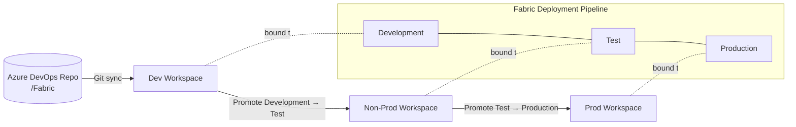
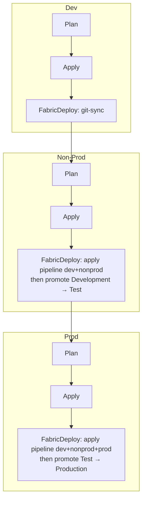
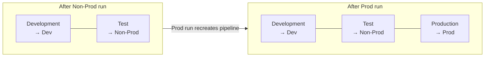

# FabricOps — Terraform-Managed Microsoft Fabric Workspaces

Infrastructure-as-Code for provisioning **Microsoft Fabric** workspaces across three
environments (Dev, Non-Prod, Prod) and promoting content between them through a
**Fabric deployment pipeline** — all orchestrated by a single Azure DevOps pipeline.

- **Terraform** (with the [`microsoft/fabric`](https://registry.terraform.io/providers/microsoft/fabric/latest/docs) provider) defines the desired state: the workspaces, their Git connection, and the deployment pipeline.
- **Azure DevOps** runs `plan` → `apply` → `fabric-deploy` for each environment, strictly in order.
- **PowerShell** scripts perform the imperative Fabric REST actions (Git sync and stage promotion) that Terraform cannot model declaratively.

---

## Table of Contents

- [What it deploys](#what-it-deploys)
- [How it deploys](#how-it-deploys)
- [Repository layout](#repository-layout)
- [Prerequisites](#prerequisites)
- [One-time setup](#one-time-setup)
- [Running locally](#running-locally)
- [Configuration reference](#configuration-reference)
- [The deployment flow in detail](#the-deployment-flow-in-detail)
- [Building the deployment pipeline incrementally](#building-the-deployment-pipeline-incrementally)
- [Adding Fabric content](#adding-fabric-content)
- [Troubleshooting](#troubleshooting)
- [Learn more](#learn-more)

---

## What it deploys

| Resource | Terraform | Notes |
|----------|-----------|-------|
| **Dev workspace** | `fabric_workspace` + `fabric_workspace_git` | Connected to this Azure DevOps repo. Content is sourced from Git. |
| **Non-Prod workspace** | `fabric_workspace` | Receives content via the deployment pipeline. |
| **Prod workspace** | `fabric_workspace` | Receives content via the deployment pipeline. |
| **Deployment pipeline** | `fabric_deployment_pipeline` | Stages `Development → Test → Production`, each bound to the matching workspace. |

Each environment is an **independent Terraform root** with its own remote state, so they can
be planned and applied in isolation. The deployment pipeline is a **fourth root** that reads
the workspace IDs from the environment states via `terraform_remote_state` and wires the
stages to the right workspaces.



---

## How it deploys

The Azure DevOps pipeline ([azure-pipelines.yml](azure-pipelines.yml)) processes the three
environments **sequentially** — Non-Prod only starts after Dev's Fabric deploy succeeds, and
Prod only after Non-Prod's. Each environment expands into three stages from the reusable
template [.azuredevops/templates/fabric-env-stages.yml](.azuredevops/templates/fabric-env-stages.yml):

1. **Plan** — `terraform init` + `terraform plan`, publishing the plan as an artifact.
2. **Apply** — `terraform apply` of the published plan (gated by an ADO *environment* for approvals), publishing the resulting `workspace_id`.
3. **FabricDeploy** — the content deploy, which differs by environment:

| Environment | `fabricDeployMode` | What happens |
|-------------|--------------------|--------------|
| **dev** | `git-sync` | Calls Fabric *Update From Git* to pull the latest committed `/Fabric` content into the Dev workspace. |
| **nonprod** | `pipeline-deploy` | Applies the deployment-pipeline root with `active_environments = ["dev","nonprod"]`, then promotes **Development → Test**. |
| **prod** | `pipeline-deploy` | Applies the deployment-pipeline root with `active_environments = ["dev","nonprod","prod"]`, then promotes **Test → Production**. |

> **Why the pipeline grows incrementally:** `fabric_deployment_pipeline.stages` is *ForceNew* —
> changing the stage list recreates the pipeline. The pipeline is wired with only the stages
> for environments that are live, expanding from two stages (when Non-Prod deploys) to three
> (when Prod deploys). Already-promoted workspace content is unaffected by the recreation;
> only the pipeline object's deployment history resets.

Authentication uses **Workload Identity Federation (OIDC)** — no secrets stored. The
`AzureCLI@2` task exposes the federated token, which is surfaced to Terraform's `azurerm`
backend and the Fabric provider as environment variables, and to the PowerShell scripts as a
Fabric access token.

---

## Repository layout

```
FabricOpsTerraformDeploy/
├── azure-pipelines.yml              # Root ADO pipeline (dev → nonprod → prod)
├── .azuredevops/
│   └── templates/
│       └── fabric-env-stages.yml    # Reusable Plan/Apply/FabricDeploy template
├── Fabric/                          # Fabric item definitions tracked in Git (Dev source)
├── scripts/
│   ├── FabricApi.ps1                # Shared Fabric REST helpers (token, request, LRO polling)
│   ├── Invoke-FabricGitSync.ps1     # Dev: Update From Git
│   └── Invoke-FabricDeployStage.ps1 # Non-Prod/Prod: promote between pipeline stages
└── Terraform/
    ├── modules/
    │   ├── workspace/               # Wraps fabric_workspace
    │   └── deployment_pipeline/     # Wraps fabric_deployment_pipeline
    ├── workspaces/
    │   ├── dev/                     # Dev workspace + Git integration root
    │   ├── nonprod/                 # Non-Prod workspace root
    │   └── prod/                    # Prod workspace root
    └── deployment_pipeline/         # Deployment pipeline root (reads workspace IDs via remote state)
```

---

## Prerequisites

| Requirement | Detail |
|-------------|--------|
| **Terraform** | `>= 1.5.0` ([install](https://developer.hashicorp.com/terraform/install)) |
| **Microsoft Fabric** | A tenant with Fabric enabled, and (optionally) a [Fabric capacity](https://learn.microsoft.com/fabric/enterprise/licenses) to assign |
| **Entra ID service principal** | Used for all automation. Needs Fabric workspace admin rights and permission to create/manage deployment pipelines |
| **Azure subscription** | Hosts the Azure Storage account used for Terraform remote state |
| **Azure DevOps** | Project + repo (this one), plus a service connection with Workload Identity Federation |
| **PowerShell 7+** | The deploy scripts target `pwsh` (`pscore`); used automatically by the ADO agent |
| **Azure CLI** | Used by the pipeline to obtain the Fabric token (`az account get-access-token`) |

### Required service principal permissions

- **Fabric tenant settings** must allow service principals to use the Fabric APIs and to create workspaces / deployment pipelines (Admin portal → Tenant settings).
- The SPN must be **Admin** on each workspace it manages.
- For Git integration, the SPN authenticates through a **pre-created Fabric connection** (`ConfiguredConnection`) — service-principal Git auth is only supported via a configured connection, not inline credentials.

---

## One-time setup

### 1. Create the Terraform state backend (Azure Storage)

```powershell
az group create --name rg-fabricops-tfstate --location eastus
az storage account create `
  --name stfabricopstfstate `
  --resource-group rg-fabricops-tfstate `
  --sku Standard_LRS `
  --kind StorageV2
az storage container create `
  --name tfstate `
  --account-name stfabricopstfstate
```

> Names must match the `backend*` variables in [azure-pipelines.yml](azure-pipelines.yml)
> (`rg-fabricops-tfstate`, `stfabricopstfstate`, `tfstate`) or be overridden there.

State keys per root: `fabric/dev.tfstate`, `fabric/nonprod.tfstate`, `fabric/prod.tfstate`,
`fabric/deployment-pipeline.tfstate`.

### 2. Create the Fabric Git connection

Create a [Fabric connection](https://learn.microsoft.com/fabric/data-factory/azure-devops-connection)
to your Azure DevOps repository and note its **connection ID** — this becomes `git_connection_id`
in the Dev tfvars. This is required because the SPN connects to Git through a configured connection.

### 3. Configure the Azure DevOps service connection (OIDC)

Create an **Azure Resource Manager** service connection named `fabric-azure-connection`
(or override `serviceConnection`) using **Workload Identity Federation**. This lets the
pipeline authenticate to both Azure (for state) and Fabric without storing secrets.
See [Workload identity federation](https://learn.microsoft.com/azure/devops/pipelines/library/connect-to-azure?view=azure-devops#create-an-azure-resource-manager-service-connection-using-workload-identity-federation).

### 4. Create ADO environments for approvals (optional but recommended)

The Apply and FabricDeploy stages target ADO *environments* named `fabric-dev`,
`fabric-nonprod`, and `fabric-prod`. Create these under **Pipelines → Environments** and add
approval checks where you want manual gates (typically Non-Prod and Prod).

### 5. Provide environment configuration

Copy each `*.example` to a real (gitignored) file and fill in your values:

```powershell
Copy-Item Terraform/workspaces/dev/terraform.tfvars.example Terraform/workspaces/dev/terraform.tfvars
Copy-Item Terraform/workspaces/dev/backend.hcl.example      Terraform/workspaces/dev/dev.backend.hcl
# repeat for nonprod, prod, and deployment_pipeline
```

At minimum, set the Dev Git integration values (`git_connection_id`, `git_organization_name`,
`git_project_name`, `git_repository_name`, `git_branch_name`).

---

## Running locally

You can apply any root by hand (useful for first-time bootstrap or debugging). From the root:

```powershell
cd Terraform/workspaces/dev

# Initialize with the backend config
terraform init -backend-config="dev.backend.hcl"

# Plan / apply (auth via tfvars or env vars)
terraform plan  -var-file="terraform.tfvars"
terraform apply -var-file="terraform.tfvars"
```

To run the Fabric REST actions locally, set a token and the required variables, then invoke the script:

```powershell
$env:FABRIC_TOKEN = az account get-access-token --resource https://api.fabric.microsoft.com --query accessToken -o tsv
$env:FABRIC_WORKSPACE_ID = terraform output -raw workspace_id
./scripts/Invoke-FabricGitSync.ps1
```

> **Order matters.** The deployment pipeline root reads the workspace IDs from each
> environment's state, so apply Dev/Non-Prod/Prod **before** applying
> `Terraform/deployment_pipeline`.

---

## Configuration reference

### Workspace roots (`Terraform/workspaces/*`)

| Variable | Default | Description |
|----------|---------|-------------|
| `tenant_id` | `null` | Entra tenant ID (or `FABRIC_TENANT_ID`). |
| `client_id` | `null` | SPN client ID (or `FABRIC_CLIENT_ID`). |
| `use_oidc` | `false` | Use Workload Identity Federation. Set `true` in CI. |
| `workspace_display_name` | `FabricOps-<Env>` | Workspace name. |
| `workspace_description` | — | Workspace description. |
| `capacity_id` | `null` | Fabric capacity to assign (null = shared). |
| `identity_type` | `null` | `SystemAssigned` or null. |
| `skip_capacity_state_validation` | `false` | Skip capacity-state checks when the caller can't list capacities. |

**Dev only — Git integration:**

| Variable | Default | Description |
|----------|---------|-------------|
| `enable_git_integration` | `true` | Connect Dev to Azure DevOps. |
| `git_connection_id` | `null` | Pre-created Fabric connection ID (required for SPN auth). |
| `git_organization_name` / `git_project_name` / `git_repository_name` / `git_branch_name` | `null` | ADO coordinates. |
| `git_directory_name` | `/Fabric` | Folder in the repo holding Fabric items (must start with `/`). |
| `git_initialization_strategy` | `PreferRemote` | `PreferRemote` seeds the workspace from Git; `PreferWorkspace` seeds Git from the workspace. |

### Deployment pipeline root (`Terraform/deployment_pipeline`)

| Variable | Default | Description |
|----------|---------|-------------|
| `backend_resource_group_name` / `backend_storage_account_name` | — | Where the environment state files live (for remote-state ingestion). |
| `backend_container_name` | `tfstate` | State container. |
| `state_keys` | `{dev, nonprod, prod → fabric/*.tfstate}` | Map of env → state blob key. |
| `deployment_pipeline_display_name` | `FabricOps-Pipeline` | Pipeline name. |
| `stages` | Development/Test/Production → dev/nonprod/prod | Ordered stages (2–10). Each stage's workspace is resolved from `source_environment`'s remote state. |
| `active_environments` | `["dev","nonprod","prod"]` | Which environments' stages are currently wired. Pipeline grows as environments come online. |

---

## The deployment flow in detail



1. **Dev** — Terraform creates/updates the Dev workspace and its Git connection. `Invoke-FabricGitSync.ps1` checks Git status and, if the remote commit differs, calls *Update From Git* and waits for the long-running operation.
2. **Non-Prod** — Terraform creates/updates the Non-Prod workspace. The deployment-pipeline root is applied with two stages (Development, Test) bound to the Dev and Non-Prod workspaces. `Invoke-FabricDeployStage.ps1` then promotes **Development → Test**.
3. **Prod** — Terraform creates/updates the Prod workspace. The deployment-pipeline root is re-applied with all three stages (recreating the pipeline). `Invoke-FabricDeployStage.ps1` promotes **Test → Production**.

The PowerShell helpers ([scripts/FabricApi.ps1](scripts/FabricApi.ps1)) wrap the
[Fabric REST API](https://learn.microsoft.com/rest/api/fabric/articles/), handling the bearer
token and the [long-running-operation](https://learn.microsoft.com/rest/api/fabric/articles/long-running-operation)
poll pattern (202 + `Location` header).

---

## Building the deployment pipeline incrementally

The deployment pipeline is **not** created up front with all three stages. Instead it is grown
as each environment comes online, driven by the `active_environments` variable that the
FabricDeploy stage passes to the `Terraform/deployment_pipeline` root. This matters because
`fabric_deployment_pipeline.stages` is **ForceNew** — any change to the stage list recreates
the whole pipeline object — and because a stage can only be wired to a workspace that already
exists in remote state.

### How `active_environments` shapes the pipeline

The deployment-pipeline root only:

1. reads the **remote state** of the environments listed in `active_environments`
   (see [Terraform/deployment_pipeline/remote_state.tf](Terraform/deployment_pipeline/remote_state.tf)), and
2. keeps the `stages` whose `source_environment` is in that list, dropping the rest
   (see the `active_stages` local in [Terraform/deployment_pipeline/main.tf](Terraform/deployment_pipeline/main.tf)).

So the same configuration produces a different pipeline depending on which environments are active:

| `active_environments` | Stages created | Bound workspaces |
|-----------------------|----------------|------------------|
| `["dev","nonprod"]` | Development, Test | Dev, Non-Prod |
| `["dev","nonprod","prod"]` | Development, Test, Production | Dev, Non-Prod, Prod |

> A deployment pipeline must have **at least two stages**, which is why the pipeline first
> appears during the **Non-Prod** run (Dev alone would be a single stage). Dev's content deploy
> is a Git sync, so it needs no pipeline.

### Initial run (greenfield) — stage by stage

On the very first pipeline run, nothing exists yet. Here is what happens to the deployment
pipeline at each environment:

| Order | Environment | `active_environments` | Deployment-pipeline action | Resulting pipeline |
|-------|-------------|------------------------|----------------------------|--------------------|
| 1 | **dev** | _n/a_ | None — Dev uses `git-sync`, not the pipeline. | _does not exist yet_ |
| 2 | **nonprod** | `["dev","nonprod"]` | `terraform apply` **creates** the pipeline with 2 stages (Development → Dev, Test → Non-Prod), then promote **Development → Test**. | 2 stages |
| 3 | **prod** | `["dev","nonprod","prod"]` | `terraform apply` sees a new stage in a ForceNew list and **recreates** the pipeline with 3 stages, then promote **Test → Production**. | 3 stages |



The one-time recreation between the Non-Prod and Prod stages is expected. It replaces the
pipeline **definition** only; the content already promoted into the Non-Prod and Prod
workspaces is untouched. What resets is the pipeline object's own deployment history.

### Second and subsequent runs (steady state)

Once Prod has been deployed at least once, `active_environments` is `["dev","nonprod","prod"]`
on every environment's run and the pipeline already has all three stages. Now Terraform's plan
for the deployment-pipeline root is a **no-op** (the stage list is unchanged), so:

- **No recreation happens** — the pipeline is stable across runs.
- Each environment's FabricDeploy stage still runs, but the `terraform apply` of the pipeline
  root simply confirms the existing state, and the only meaningful action is the **promotion**:

| Order | Environment | Pipeline `apply` | Promotion |
|-------|-------------|------------------|-----------|
| 1 | **dev** | _n/a_ | Git sync pulls the latest commit into Dev. |
| 2 | **nonprod** | no-op (3 stages already present) | **Development → Test** |
| 3 | **prod** | no-op (3 stages already present) | **Test → Production** |

In other words: the **first** run *builds* the pipeline (and recreates it once when Prod is
added), while **every run thereafter** just *uses* it to promote content forward — Dev via Git
sync, then Test and Production via stage promotions.

> **Changing stages later** (renaming a stage, reordering, adding a fourth) will again trigger a
> ForceNew recreation on the next run because of the provider's behavior — plan output will show
> the pipeline being replaced. Content in the bound workspaces is preserved; only the pipeline
> object and its history are recreated.

---

## Adding Fabric content

The Dev workspace is the source of truth and is wired to the `/Fabric` directory of this repo.

1. Author items in the Dev workspace, or commit item definitions under [Fabric/](Fabric/).
2. Use the workspace's **Source control** panel to commit workspace changes to Git, or push item definitions directly.
3. On merge to `main`, the pipeline syncs Dev from Git, then promotes Dev → Test → Production through the deployment pipeline.

See [Fabric Git integration](https://learn.microsoft.com/fabric/cicd/git-integration/intro-to-git-integration)
for supported item types and the on-disk format.

---

## Troubleshooting

| Symptom | Likely cause / fix |
|---------|--------------------|
| `terraform init` fails on the backend | Storage account/container/key don't exist or the SPN lacks **Storage Blob Data Contributor**. |
| Fabric provider auth errors | Tenant settings disallow service principals, or the SPN isn't a workspace admin. |
| Git connection fails for the SPN | Inline Git credentials aren't supported for SPNs — supply a valid `git_connection_id` (`ConfiguredConnection`). |
| `source_environment` state not found | Apply the workspace roots **before** the deployment-pipeline root; confirm `state_keys` match the backend keys. |
| Pipeline recreated unexpectedly | Expected — `stages` is ForceNew; expanding `active_environments` recreates the pipeline definition (content is preserved). |
| Transient `context deadline exceeded` on init | Registry timeout — re-run `terraform init`. |

---

## Learn more

- [Microsoft Fabric documentation](https://learn.microsoft.com/fabric/)
- [`microsoft/fabric` Terraform provider](https://registry.terraform.io/providers/microsoft/fabric/latest/docs)
- [Fabric REST API reference](https://learn.microsoft.com/rest/api/fabric/articles/)
- [Fabric Git integration](https://learn.microsoft.com/fabric/cicd/git-integration/intro-to-git-integration)
- [Fabric deployment pipelines](https://learn.microsoft.com/fabric/cicd/deployment-pipelines/intro-to-deployment-pipelines)
- [Terraform azurerm backend](https://developer.hashicorp.com/terraform/language/settings/backends/azurerm)
- [Azure DevOps Workload Identity Federation](https://learn.microsoft.com/azure/devops/pipelines/library/connect-to-azure?view=azure-devops#create-an-azure-resource-manager-service-connection-using-workload-identity-federation)
